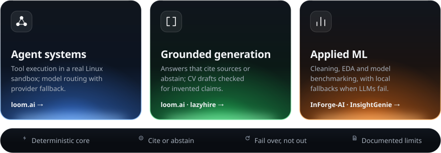
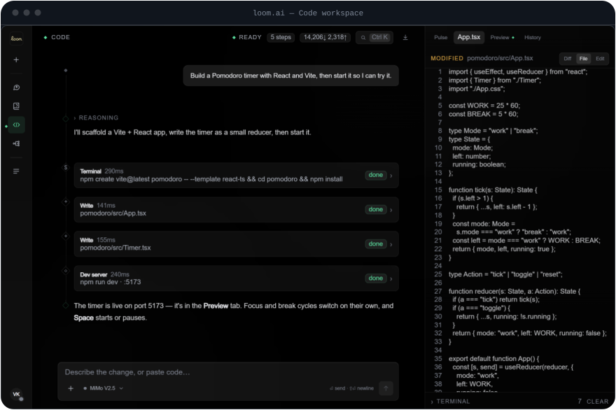
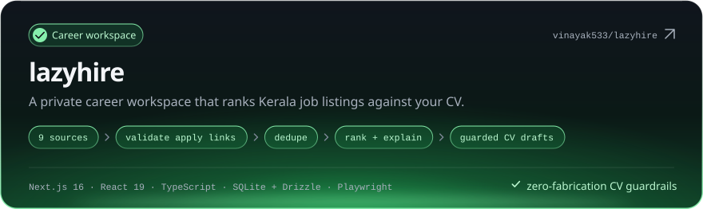
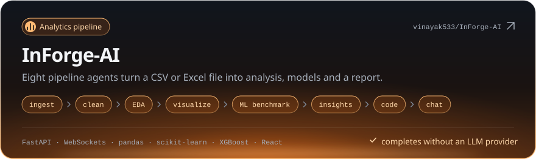
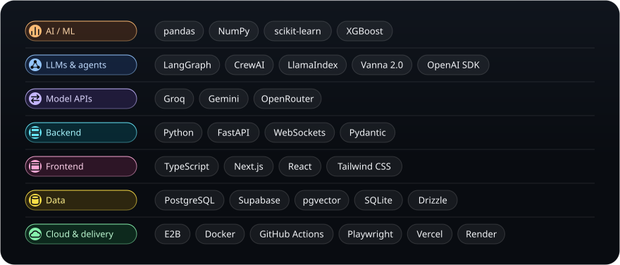

<picture>
  <source media="(max-width: 639px), (min-width: 768px) and (max-width: 959px)" srcset="assets/svg/hero-dark-compact.svg">
  
</picture>

  &nbsp;
  &nbsp;
  

I build agent systems, grounded LLM applications and ML pipelines that expose how they work: live tool traces, cited sources, tested guardrails and documented limits. AI/ML Engineer at **AMnova Technologies**, Kochi.

 

### Expertise

<picture>
  <source media="(max-width: 639px), (min-width: 768px) and (max-width: 959px)" srcset="assets/svg/expertise-dark-compact.svg">
  
</picture>

 

### Selected work

<a href="https://github.com/vinayak533/loom.ai">
<picture>
  <source media="(max-width: 639px), (min-width: 768px) and (max-width: 959px)" srcset="assets/svg/card-loom-dark-compact.svg">
  
</picture>
</a>

Real interface. The agent turn is scripted and played through the live WebSocket UI — <a href="https://github.com/vinayak533/loom.ai#-project-showcase">capture notes</a>.

[Repository ↗](https://github.com/vinayak533/loom.ai) &nbsp;·&nbsp; [Architecture](https://github.com/vinayak533/loom.ai/blob/main/docs/architecture.md) &nbsp;·&nbsp; [Known limits](https://github.com/vinayak533/loom.ai/blob/main/docs/known-limits.md)

Engineering notes &amp; more screens

- **Execution** — one typed WebSocket event contract connects the LangGraph agent to the interface. Read-only tool batches run concurrently; writes run in order. Graph checkpoints let sessions survive a cold start.
- **Routing** — each iteration is classified and sent to the model registered for that class. Rate limits, quota and 5xx errors retry on up to two alternate providers. Message and usage writes stay off the token path.
- **Measured** — median time-to-first-token fell from 8.9s to 5.0s on a ~80K-token loop once the transcript was served from the provider's prompt cache. [Method](https://github.com/vinayak533/loom.ai/blob/main/docs/performance.md).
- **Grounding** — notebooks answer only from uploaded sources with `[n]` citations, or say the sources don't cover it. Retrieval uses lexical hashed vectors, not semantic search.
- **Scope** — Chat, Code, Learn (ten authored courses) and ten specialist agents with human approval. Code needs an E2B key; AI features need a model-provider key.

 

<a href="https://github.com/vinayak533/lazyhire">
<picture>
  <source media="(max-width: 639px), (min-width: 768px) and (max-width: 959px)" srcset="assets/svg/card-lazyhire-dark-compact.svg">
  
</picture>
</a>

Engineering notes &amp; product screens

- **Discovery** — nine Kerala sources (Technopark, Infopark, UL CyberPark and others) feed apply-link validation, then deduplication on canonical URL plus company, title and location, then ranking by freshness, source quality, location, role fit and skills.
- **AI boundary** — the assistant answers from an authored knowledge corpus before any optional LLM call. Tailored CVs are rejected if they add numbers, requirements or changes that can't be traced to the source CV.
- **Privacy** — encrypted CV and account data, per-request CSP nonces, CSRF checks on every mutation, private-response cache controls, upload scanning and audit events. SQLite with Drizzle migrations keeps setup self-contained.
- **Verification** — Node tests and Playwright cover auth, discovery, CV workflows, Career OS and privacy boundaries.

Career OS, seeded example data.

Ranked matches, fixture listings.

 

<a href="https://github.com/vinayak533/InForge-AI">
<picture>
  <source media="(max-width: 639px), (min-width: 768px) and (max-width: 959px)" srcset="assets/svg/card-inforge-dark-compact.svg">
  
</picture>
</a>

Engineering notes

- **Pipeline** — an orchestrator runs eight agents in order and streams each stage over a WebSocket; late-connecting clients are replayed the history.
- **Deterministic core** — pandas, scikit-learn and XGBoost compute every result. LLMs (OpenRouter, Groq, Gemini) only write explanations, chart strategy, code and chat answers.
- **Resilience** — every LLM call has a local fallback, so an invalid key, rate limit or outage degrades the prose, not the analysis.
- **Outputs** — cleaned CSV, charts, benchmarked models, a PDF report, Python code and contextual chat. Runs locally.

More projects — retrieval, evaluation &amp; applied ML

- [**NL2SQL-AI-Assistant**](https://github.com/vinayak533/NL2SQL-AI-Assistant) — validated SQL over a clinic database; 18/20 on its own benchmark. Vanna 2.0 · Gemini · FastAPI
- [**llm-battle-arena**](https://github.com/vinayak533/llm-battle-arena) — two models answer, a third judges with structured verdicts. LlamaIndex · Groq
- [**InsightGenie**](https://github.com/vinayak533/InsightGenie-Data-Analyzer) — CSV health checks, charts and rule-based ML recommendations. FastAPI · React · pandas
- [**ARIA churn platform**](https://github.com/vinayak533/bank-churn-intelligence-platform) — XGBoost churn estimates, explained by an LLM and read aloud. FastAPI · Groq · ElevenLabs
- [**PredictLab**](https://github.com/vinayak533/PredictLab-) — three health-risk classifiers behind one API. scikit-learn · FastAPI · Docker
- [**Medical Voice & Vision**](https://github.com/vinayak533/AI-Medical-Voice-Vision-Assistant) — spoken question plus image in, spoken answer out. Groq · Gradio · gTTS
- [**Multi-agent stock analysis**](https://github.com/vinayak533/AI-Multi-Agent-Stock-Analysis-Trading-System) — two agents turn a price snapshot into a Buy/Sell/Hold rationale. CrewAI · yfinance · Streamlit

 

### GitHub activity

<a href="https://github.com/vinayak533?tab=overview">
<picture>
  <source media="(max-width: 639px), (min-width: 768px) and (max-width: 959px)" srcset="assets/svg/activity-dark-compact.svg">
  
</picture>
</a>

 

### Tech stack

<picture>
  <source media="(max-width: 639px), (min-width: 768px) and (max-width: 959px)" srcset="assets/svg/stack-dark-compact.svg">
  
</picture>

Only technologies declared in the dependency files of the projects above.

 

### Contact

<a href="mailto:vinayakkvjob@gmail.com">
<picture>
  <source media="(max-width: 639px), (min-width: 768px) and (max-width: 959px)" srcset="assets/svg/contact-dark-compact.svg">
  
</picture>
</a>

[LinkedIn](https://www.linkedin.com/in/vinayak-kv-ds) &nbsp;·&nbsp; [Portfolio](https://vinayak533.github.io/VINAYAK_PORTFOLIO/) &nbsp;·&nbsp; [All repositories](https://github.com/vinayak533?tab=repositories)
