

<picture>
  <source media="(prefers-color-scheme: dark)" srcset="assets/svg/hero-dark.svg">
  
</picture>

<picture>
  <source media="(prefers-color-scheme: dark)" srcset="assets/svg/status-dark.svg">
  
</picture>

 

<picture>
  <source media="(prefers-color-scheme: dark)" srcset="assets/svg/sec-01-dark.svg">
  
</picture>

<picture>
  <source media="(prefers-color-scheme: dark)" srcset="assets/svg/terminal-dark.svg">
  
</picture>

  

<picture>
  <source media="(prefers-color-scheme: dark)" srcset="assets/svg/sec-02-dark.svg">
  
</picture>

<picture>
  <source media="(prefers-color-scheme: dark)" srcset="assets/svg/system-map-dark.svg">
  
</picture>

Every capability names the repository that implements it.

  

<picture>
  <source media="(prefers-color-scheme: dark)" srcset="assets/svg/sec-03-dark.svg">
  
</picture>

<picture>
  <source media="(prefers-color-scheme: dark)" srcset="assets/svg/card-loom-dark.svg">
  
</picture>

<a href="https://github.com/vinayak533/loom.ai"><b>github.com/vinayak533/loom.ai</b></a>

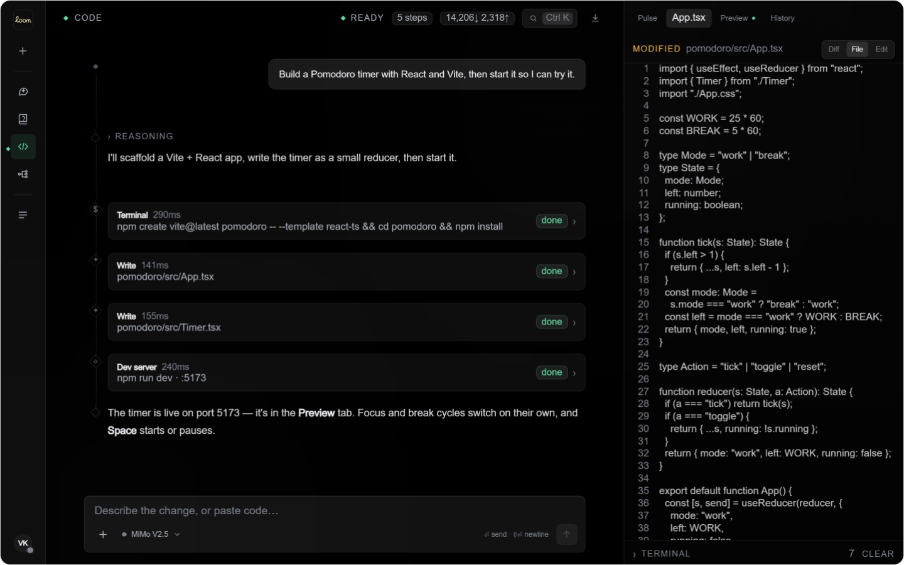

Code workspace: each tool call is a timed card in the trace, and the files it writes open in the editor. This is a scripted demo turn played through the real UI; the repo's README explains how it was captured.

<b>More from loom.ai</b>: specialist agents, Learn

 
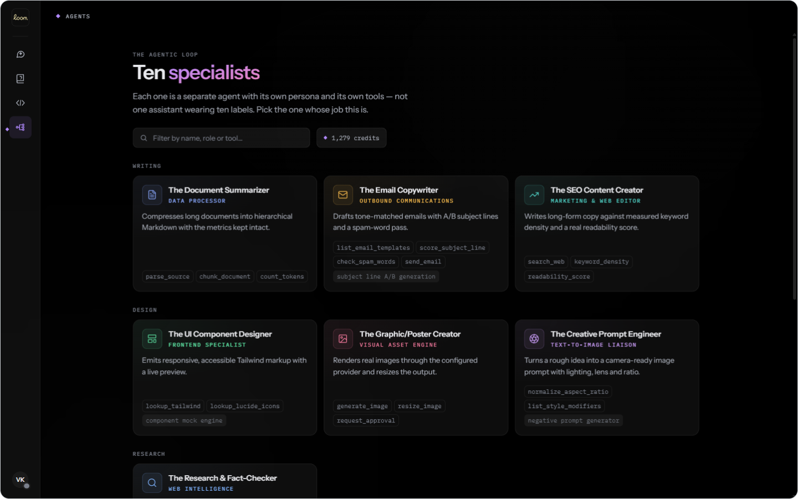
Ten specialists, each a separate agent with its own persona and toolset.
  
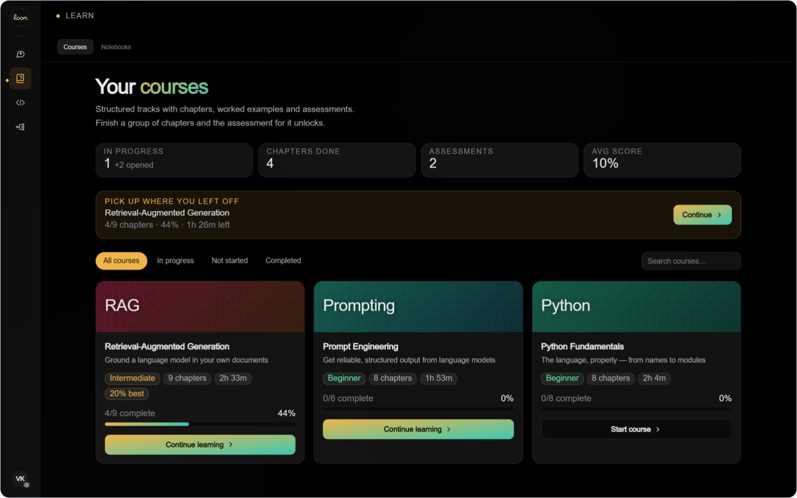
Learn: ten authored courses with server-graded assessments and weak-area review.

 

<picture>
  <source media="(prefers-color-scheme: dark)" srcset="assets/svg/card-lazyhire-dark.svg">
  
</picture>

<a href="https://github.com/vinayak533/lazyhire"><b>github.com/vinayak533/lazyhire</b></a>

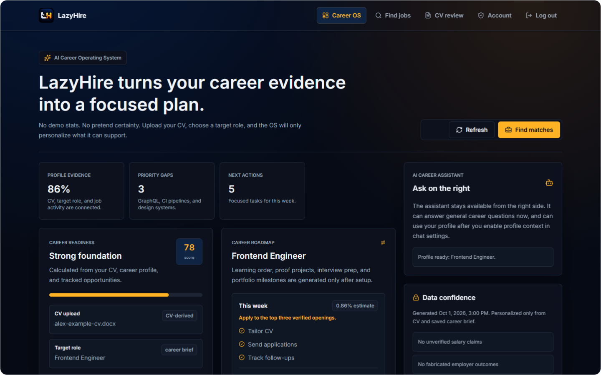

Career OS: readiness, gaps and a roadmap computed only from CV evidence and saved applications. Seeded example data.

<b>More from lazyhire</b>: ranked matches, CV review

 
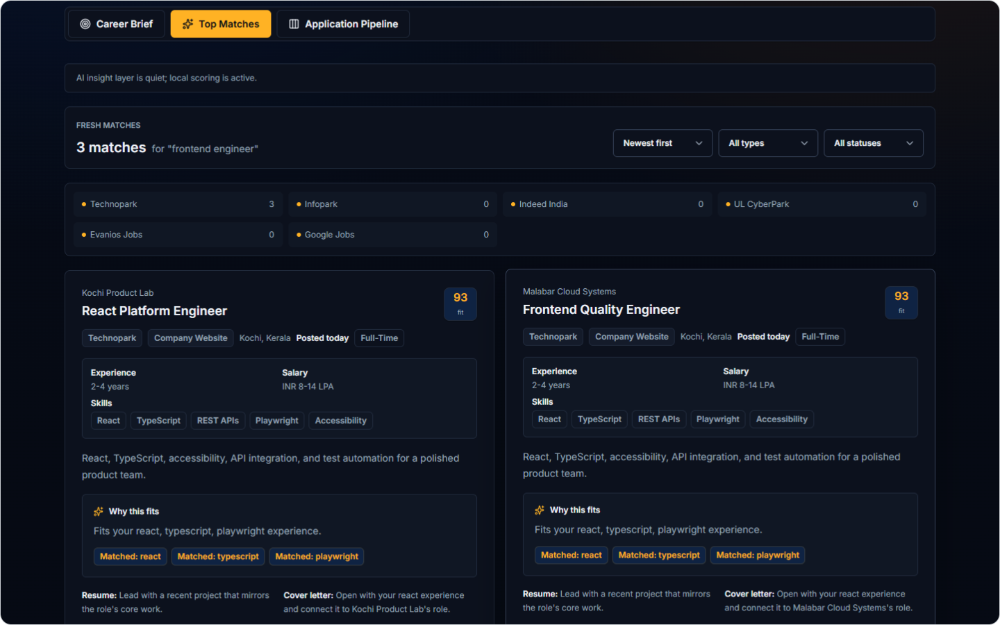
Ranked matches with per-source counts, the skills behind each fit score, and cross-source duplicate detection. Fixture listings.
  
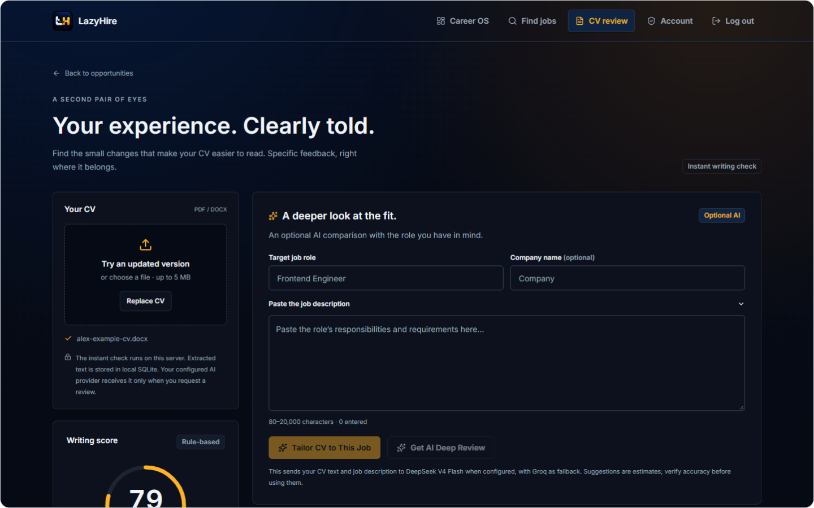
CV review: a rule-based writing score that runs on the server, plus an optional AI review that only runs when you ask for it.

 

<picture>
  <source media="(prefers-color-scheme: dark)" srcset="assets/svg/card-inforge-dark.svg">
  
</picture>

<a href="https://github.com/vinayak533/InForge-AI"><b>github.com/vinayak533/InForge-AI</b></a>

  

<picture>
  <source media="(prefers-color-scheme: dark)" srcset="assets/svg/sec-04-dark.svg">
  
</picture>

<picture>
  <source media="(prefers-color-scheme: dark)" srcset="assets/svg/arch-loom-dark.svg">
  
</picture>

<b>loom.ai, one Code turn.</b> Blue is the request; amber is what streams back. The router shows a rate-limited provider falling over to the next one.

  

<picture>
  <source media="(prefers-color-scheme: dark)" srcset="assets/svg/arch-lazyhire-dark.svg">
  
</picture>

<b>lazyhire.</b> Discovery is deterministic. The model is optional and sits behind privacy checks and a fabrication guard.

  

<picture>
  <source media="(prefers-color-scheme: dark)" srcset="assets/svg/arch-inforge-dark.svg">
  
</picture>

<b>InForge-AI.</b> Every number comes from the deterministic core; the LLMs only write the explanations.

  

<picture>
  <source media="(prefers-color-scheme: dark)" srcset="assets/svg/sec-05-dark.svg">
  
</picture>

<b>loom.ai</b>: agent workspace · Python + TypeScript

 

| | |
|---|---|
| **Challenge** | A coding agent is only useful if it can run what it writes, and if you can watch it do so. |
| **Engineering** | One typed event contract (`events.py` ⇄ `events.ts`) is the only interface between the agent and the UI. Tokens, tool calls, stdout chunks, file diffs and preview readiness all travel over one WebSocket. |
| **Intelligence** | A LangGraph `StateGraph` streams each model call; conditional edges route every `tool_use` to its node. A classifier labels each iteration (`fast_simple`, `code_editing`, `visual_structural`, `complex_longhorizon`) and routes it to the model registered for that class, across Groq, OpenRouter and OpenCode. |
| **System design** | Read-only tool batches run concurrently; writes run in order. Message and usage writes are fire-and-forget, so nothing sits on the token path. Graph state is checkpointed (SQLite locally, Postgres in production), so sessions survive a cold start. |
| **Measured** | On a ~80K-token loop, median time-to-first-token went from **8.9s to 5.0s** once the transcript was served from the provider's prompt cache ([`docs/performance.md`](https://github.com/vinayak533/loom.ai/blob/main/docs/performance.md)). |
| **Works today** | Chat, Code (E2B sandbox, live preview, terminal, git), Learn (10 courses, notebooks that cite their sources) and 10 specialist agents with human approval. A stated limit: notebook retrieval is lexical (hashed bag-of-words), not semantic. |

<b>lazyhire</b>: career workspace · TypeScript

 

| | |
|---|---|
| **Challenge** | The same job appears on several portals, apply links often lead to homepages, and AI CV rewriters invent experience. |
| **Engineering** | One adapter per source (Technopark, Infopark, UL CyberPark, Indeed and others) feeds apply-link validation. Listings are merged on canonical URL plus company, normalized title and location, then ranked on freshness, source quality, location, role fit and skill overlap. |
| **Intelligence** | CV review and tailoring go through a DeepSeek-compatible model with Groq as fallback. `tailor-guardrails.ts` rejects drafts with numbers (including spelled-out ones), requirements or changes that can't be traced to the source CV. The assistant answers from an authored knowledge corpus before it calls an LLM. |
| **System design** | Per-request CSP nonce, CSRF protection on every mutation, AES-256-GCM for CV and account data, `no-store` on private responses, upload scanning and audit events. SQLite with Drizzle migrations, so it runs without managed infrastructure. |
| **Works today** | Discovery, ranked matches, an application pipeline, CV parse/review/tailor, Career OS and the assistant. Node tests and Playwright E2E cover auth, discovery, links, CV, Career OS and privacy boundaries. |

<b>InForge-AI</b>: analytics pipeline · Python + React

 

| | |
|---|---|
| **Challenge** | The first hours with any new dataset go into profiling and cleaning before any analysis starts. |
| **Engineering** | An orchestrator runs eight agents in order and streams each stage's state over a WebSocket. Clients that connect late are replayed the history. |
| **Intelligence** | pandas, scikit-learn and XGBoost do the analysis: problem-type detection, cleaning, EDA and model comparison. LLMs (OpenRouter, Groq, Gemini) write the explanations, chart strategy, generated code and chat answers. |
| **System design** | Every LLM call has a local fallback. An invalid key, rate limit or outage degrades the prose, not the results. |
| **Works today** | CSV/XLS/XLSX in → cleaned data, charts, benchmarked models, a PDF report, Python code and contextual chat. Runs locally; the hosted demo's backend is currently offline. |

 

**Also built**

| Project | What it does | Stack |
|---|---|---|
| [NL2SQL-AI-Assistant](https://github.com/vinayak533/NL2SQL-AI-Assistant) | Plain-English questions → validated SQL over a clinic database. 18 of 20 on its own benchmark. | Vanna 2.0 · Gemini · FastAPI |
| [llm-battle-arena](https://github.com/vinayak533/llm-battle-arena) | Two models answer, a third judges (LLM-as-a-judge, JSON verdicts) | LlamaIndex · Groq |
| [InsightGenie](https://github.com/vinayak533/InsightGenie-Data-Analyzer) | CSV health checks, charts and rule-based ML recommendations | FastAPI · React · pandas |
| [ARIA churn platform](https://github.com/vinayak533/bank-churn-intelligence-platform) | XGBoost churn estimate, explained by an LLM and read aloud | FastAPI · XGBoost · Groq · ElevenLabs |
| [PredictLab](https://github.com/vinayak533/PredictLab-) | Three health-risk classifiers behind one FastAPI app | scikit-learn · FastAPI · Docker |
| [Medical Voice & Vision](https://github.com/vinayak533/AI-Medical-Voice-Vision-Assistant) | Spoken question + image → transcribed, answered, spoken back | Groq · Gradio · gTTS |
| [Multi-agent stock analysis](https://github.com/vinayak533/AI-Multi-Agent-Stock-Analysis-Trading-System) | Two CrewAI agents turn a price snapshot into a Buy/Sell/Hold rationale | CrewAI · yfinance · Streamlit |

 

<picture>
  <source media="(prefers-color-scheme: dark)" srcset="assets/svg/sec-06-dark.svg">
  
</picture>

<picture>
  <source media="(prefers-color-scheme: dark)" srcset="assets/svg/stack-dark.svg">
  
</picture>

Only technologies declared in the dependency files of the projects above.

  

<picture>
  <source media="(prefers-color-scheme: dark)" srcset="assets/svg/sec-07-dark.svg">
  
</picture>

<picture>
  <source media="(prefers-color-scheme: dark)" srcset="assets/svg/activity-dark.svg">
  
</picture>

  

<picture>
  <source media="(prefers-color-scheme: dark)" srcset="assets/svg/sec-08-dark.svg">
  
</picture>

**`DETERMINISTIC CORE`**
Compute what can be computed. InForge-AI cleans, profiles and benchmarks with pandas and scikit-learn, and still finishes when every LLM call fails.

**`CITE OR ABSTAIN`**
loom.ai's notebooks answer only from uploaded sources with `[n]` citations, or say the sources don't cover the question. lazyhire rejects tailored CVs that introduce numbers the original doesn't contain.

**`FAIL OVER, NOT OUT`**
A rate-limited provider should trigger a reroute, not an error page. loom.ai retries on up to two alternate providers and bills only for the model that answered.

**`WRITE DOWN THE LIMITS`**
Each flagship README has a limits section: lexical retrieval, single-instance rate limits, and which screenshots are scripted.

 

<picture>
  <source media="(prefers-color-scheme: dark)" srcset="assets/svg/sec-09-dark.svg">
  
</picture>

| Credential | Context |
|---|---|
| **AI/ML Engineer** | AMnova Technologies · Kochi |
| **Top 2% globally** | LeetCode |
| **Finalist** | HackerRank Orchestrate Hackathon |

 

<picture>
  <source media="(prefers-color-scheme: dark)" srcset="assets/svg/sec-10-dark.svg">
  
</picture>

<picture>
  <source media="(prefers-color-scheme: dark)" srcset="assets/svg/footer-dark.svg">
  
</picture>

Open to AI/ML and LLM engineering roles: remote, Bangalore, Kochi or Hyderabad.

[LinkedIn](https://www.linkedin.com/in/vinayak-kv-ds) &nbsp;·&nbsp; [Portfolio](https://vinayak533.github.io/VINAYAK_PORTFOLIO/) &nbsp;·&nbsp; [vinayakkvjob@gmail.com](mailto:vinayakkvjob@gmail.com)

